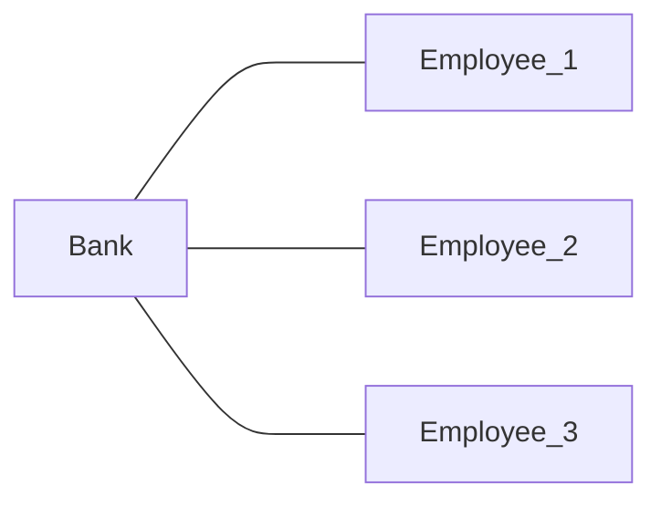
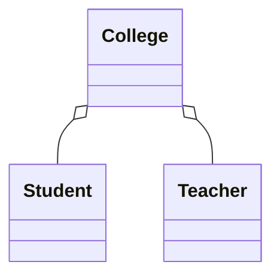
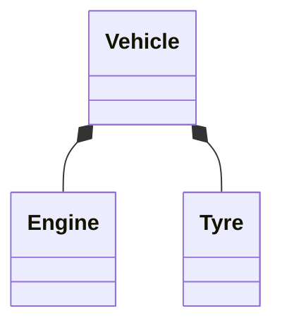

# Ref
- [GFG](https://www.geeksforgeeks.org/association-composition-aggregation-java/)

# Diagram
- Association : one-to-many relationship

```mermaid
flowchart LR
    B[Bank]
    Emp1[Employee_1]
    Emp2[Employee_2]
    Emp3[Employee_3]
    
    B ---- Emp1
    B ---- Emp2
    B ---- Emp3
```
- Aggregation

```mermaid
classDiagram
    College o-- Student
    College o-- Teacher
```
- Composition

```mermaid
classDiagram
    Vehicle *-- Engine
    Vehicle *-- Tyre
```